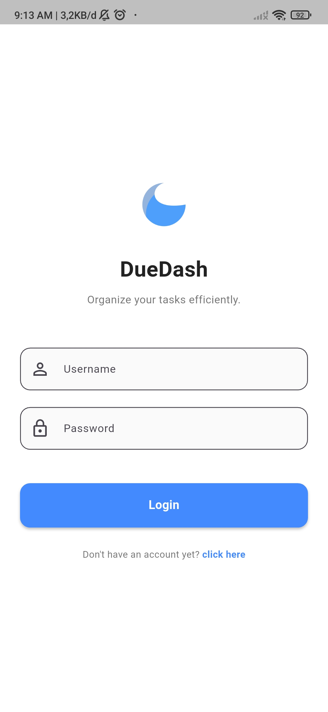
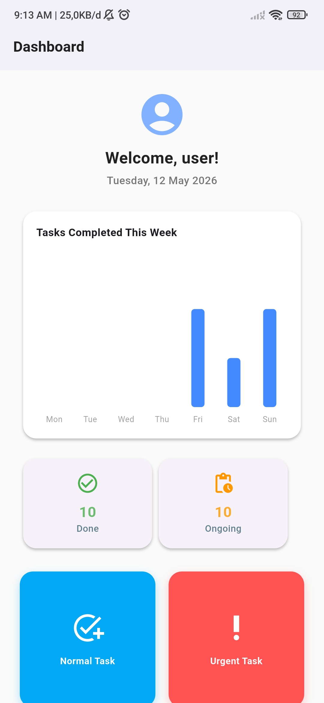

# 📝 DueDash

DueDash, sebuah aplikasi manajemen tugas (To-Do List) modern yang dibangun menggunakan **Flutter**. Aplikasi ini dirancang untuk membantu pengguna mengelola tugas harian mereka dengan fitur prioritas, statistik mingguan, dan keamanan data.

---

## ✨ Fitur Utama

*   **🔐 Autentikasi Pengguna**: Sistem Login dan Register yang aman menggunakan enkripsi **BCrypt**.
*   **📊 Dashboard Informatif**: Grafik statistik mingguan menggunakan `fl_chart` untuk melacak tugas yang selesai.
*   **📂 Manajemen Tugas Terbagi**: 
    *   **Normal Task**: Untuk tugas harian biasa.
    *   **Urgent Task**: Untuk tugas mendesak dengan penanda khusus.
*   **📱 UI Modern**: Desain bersih dengan *custom components* dan navigasi yang intuitif.
*   **💾 Penyimpanan Lokal**: Menggunakan **SQLite** (`sqflite`) agar data tetap tersimpan meskipun aplikasi ditutup.

---

## 🛠️ Tech Stack

*   **Framework**: [Flutter](https://flutter.dev)
*   **Language**: [Dart](https://dart.dev)
*   **State Management**: [Provider](https://pub.dev/packages/provider)
*   **Database**: [SQFlite](https://pub.dev/packages/sqflite)
*   **UI Components**: Material Design 3
*   **Others**: `fl_chart`, `shared_preferences`, `bcrypt`.

---

## 🚀 Memulai

### Prasyarat
*   Flutter SDK terinstal (minimal v3.11.5)
*   Android Studio / VS Code

### Instalasi
1.  Clone repository ini:
    ```bash
    git clone https://github.com/username/todolist.git
    ```
2.  Masuk ke direktori project:
    ```bash
    cd todolist
    ```
3.  Install dependencies:
    ```bash
    flutter pub get
    ```
4.  Jalankan aplikasi:
    ```bash
    flutter run
    ```

---

## 📸 Screenshots

### login



### Dashboard



---

## 📄 Lisensi
Didistribusikan di bawah Lisensi MIT. Lihat `LICENSE` untuk informasi lebih lanjut.
